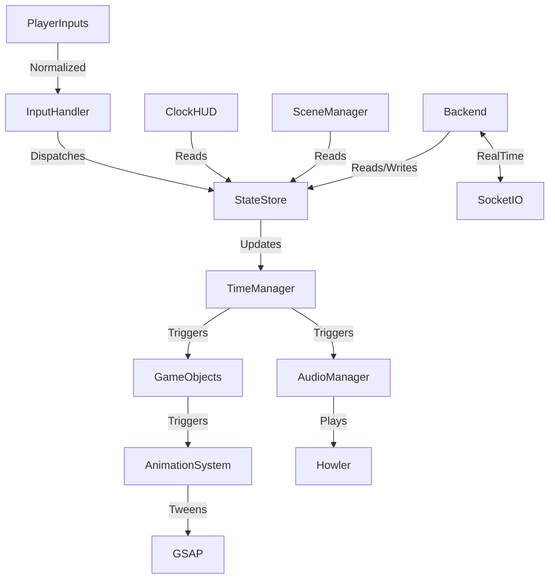

# Time Oddity – Game Architecture

This document outlines the complete technical architecture of the game *Time Oddity*, including its file structure, functional responsibilities, state management, and inter-component connections.

---

## 📁 File + Folder Structure

```
/time-oddity/
├── /public/
│   ├── index.html              # Game container and bootstrapping
│   └── assets/                 # Static assets (images, sprites, sounds)
│       ├── sprites/
│       ├── audio/
│       └── backgrounds/
├── /src/
│   ├── main.js                 # Game entrypoint and config
│   ├── game.js                 # Instantiates Phaser.Game and attaches scenes
│   ├── /scenes/                # Game scenes per act or function
│   │   ├── BootScene.js
│   │   ├── MenuScene.js
│   │   ├── PauseScene.js
│   │   ├── Act1Scene.js
│   │   ├── Act2Scene.js
│   │   ├── Act3Scene.js
│   │   └── FinaleScene.js
│   ├── /objects/               # Reusable entities and game objects
│   │   ├── Tess.js
│   │   ├── SecondHander.js
│   │   ├── HourglassSpectre.js
│   │   ├── ChronoShard.js
│   │   └── Portal.js
│   ├── /systems/               # Core game systems
│   │   ├── TimeManager.js      # Manages Pause, Echo, Fold mechanics
│   │   ├── InputHandler.js     # Normalizes input across devices
│   │   ├── AudioManager.js     # Wraps Howler.js for dynamic layering
│   │   ├── AnimationSystem.js  # Integrates GSAP with Phaser objects
│   ├── /ui/                    # HUD and interface components
│   │   ├── ClockHUD.js
│   │   └── DialogueBox.js
│   └── /state/                 # Centralized game state
│       ├── store.js            # State container and observer logic
│       └── actions.js          # Predefined state mutations
├── /server/                    # Node.js backend
│   ├── index.js                # Express app entry
│   ├── routes.js               # REST API routes
│   ├── socket.js               # Socket.IO realtime events
│   └── gameStateSync.js        # Optional server-side timeline validation
├── /tests/                     # Unit and integration tests
│   ├── scenes.test.js
│   └── systems.test.js
├── package.json
├── README.md
└── vite.config.js              # Bundler config
```

---

## 🧩 What Each Part Does

| Module | Purpose |
|--------|---------|
| **Phaser Game Engine** (`game.js`, `/scenes/`) | Manages game loop, physics, rendering, and input. Each scene corresponds to a narrative act. |
| **Game Objects** (`/objects/`) | Defines characters, enemies, and interactive objects. Each is a Phaser class extended with animations and behavior. |
| **TimeManager** (`/systems/`) | Central controller for Tess's abilities: Pause, Echo, and Fold. Communicates with state and scene layers. |
| **GSAP** (`AnimationSystem.js`) | Animates visual transitions, time-fold distortions, UI effects like ripples and glows. |
| **Howler.js** (`AudioManager.js`) | Plays dynamic music layers, echoes, and clock ticks. Interacts with game state for adaptive sound. |
| **HUD** (`ClockHUD.js`) | Renders cooldowns for time mechanics via clockface overlays. Integrated with state observers. |
| **Backend** (`/server/`) | Handles optional features like saving progress, sharing time-ghost replays, multiplayer, or analytics. |
| **Socket.IO** (`socket.js`) | Enables real-time sync between player actions and server (for Echo validations or multiplayer). |
| **State Store** (`/state/`) | Centralized game state manager (Redux-like). Tracks Tess’s time charges, portal pairs, dialogue flags, etc. |
| **InputHandler** | Abstracts inputs for keyboard, gamepad, and mobile touch, normalizing them for consistent use. |

---

## 🧠 Where State Lives

### Centralized State Container (`/state/store.js`)
- Inspired by Redux, state is stored in a single source of truth with observable hooks used in scenes and systems.
- Example State Shape:
```js
{
  player: {
    position: { x, y },
    health: 3,
    timeAbilities: {
      pauseAvailable: true,
      echoAvailable: false,
      foldPortals: [ { x1, y1 }, { x2, y2 } ]
    }
  },
  world: {
    activeScene: 'Act2Scene',
    portalsOpen: true,
    echoTrail: [ /* last 5s actions */ ]
  },
  ui: {
    showDialogue: true,
    hudCooldowns: { pause: 2.3, echo: 0 }
  }
}
```

---

## 🔗 How Services Connect



---

## 🧠 AI + LLM Compatibility Highlights

- All major libraries (Phaser, GSAP, Howler.js, Express, Socket.IO) are **widely documented** and **LLM-friendly**.
- Declarative animation (`GSAP.Timeline`) and sound effects (`sound.play('id')`) allow AI agents to **reason predictably**.
- State separation from scenes encourages **modular design**, which aligns with automated code generation practices.

---

## ✅ Summary

The architecture of *Time Oddity* is optimized for maintainability, modularity, and AI-assisted development. Its declarative systems for animation, sound, and state transitions provide clean interfaces that reduce bugs and enable scalable growth. The codebase encourages scene-based development while preserving centralized control of the timeline-altering mechanics that define the game’s identity.

