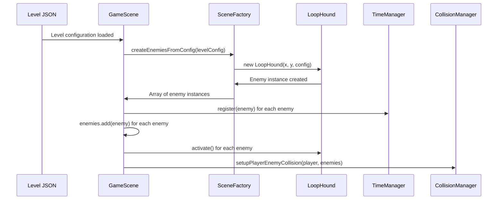
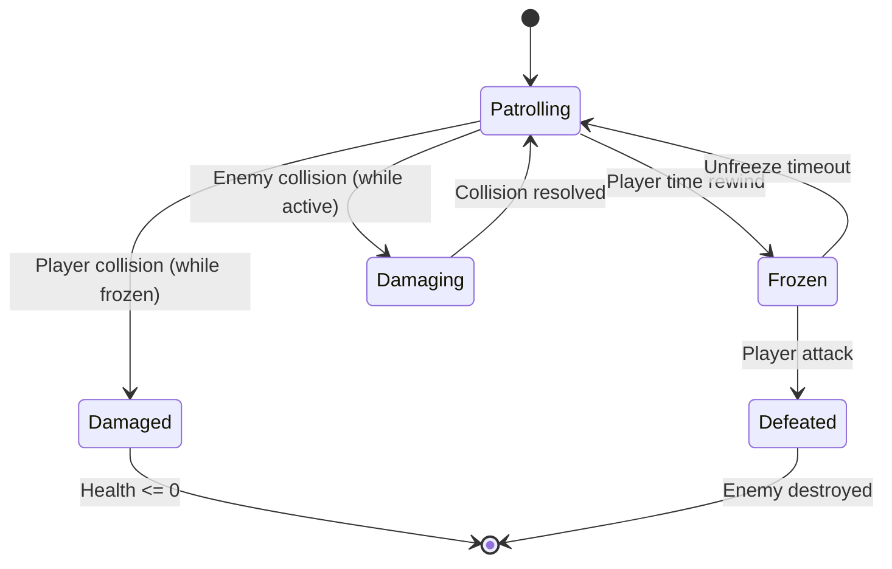

# Enemy System Architecture

This document provides comprehensive documentation of the Time Oddity enemy system architecture, covering JSON-driven configuration, runtime behavior, and system interactions.

## Overview

The enemy system follows a factory-based pattern that reads enemy configurations from JSON level files and creates runtime enemy instances with full integration into the game's physics, collision, time reversal, and state management systems.

## Architecture Components

### 1. Configuration Layer (JSON)

**File**: Level configuration files (e.g., `client/src/config/test-level.json`)

Enemies are defined in the level JSON under the `enemies` array:

```json
{
  "enemies": [
    {
      "type": "LoopHound",
      "x": 300,
      "y": 450,
      "patrolDistance": 150,
      "direction": 1,
      "speed": 80
    }
  ]
}
```

**Schema Documentation**: See `agent_docs/level-creation/level-format.md` §4 for complete JSON schema.

### 2. Factory Layer (SceneFactory)

**File**: `client/src/systems/SceneFactory.js`

**Method**: `createEnemiesFromConfig(levelConfig)`

**Responsibilities**:
- Parse enemy configurations from JSON
- Instantiate enemy classes based on `type` field
- Configure enemy properties from JSON parameters
- Return array of configured enemy instances

**Implementation Pattern**:
```javascript
createEnemiesFromConfig(levelConfig) {
  if (!levelConfig?.enemies) return [];
  
  return levelConfig.enemies.map(enemyConfig => {
    switch (enemyConfig.type) {
      case 'LoopHound':
        return new LoopHound(
          this.scene,
          enemyConfig.x,
          enemyConfig.y,
          enemyConfig.texture || 'enemies',
          enemyConfig.frame || 'barnacle_attack_rest',
          {
            patrolDistance: enemyConfig.patrolDistance || 200,
            direction: enemyConfig.direction || 1,
            speed: enemyConfig.speed || 80
          }
        );
      default:
        console.warn(`Unknown enemy type: ${enemyConfig.type}`);
        return null;
    }
  }).filter(Boolean);
}
```

### 3. Integration Layer (GameScene)

**File**: `client/src/scenes/GameScene.js`

**Method**: `createEnemiesWithFactory(levelConfig, sceneFactory)`

**Responsibilities**:
- Call SceneFactory to create enemies from configuration
- Register enemies with TimeManager for time reversal
- Add enemies to physics groups for collision detection
- Set up collision detection between player and enemies
- Activate enemy AI and behavior systems

**Integration Points**:

#### 3.1 TimeManager Integration
```javascript
enemies.forEach(enemy => {
  if (this.timeManager) {
    this.timeManager.register(enemy);
  }
});
```

**Purpose**: Enables time reversal for enemy state and position.

**Contract**: Enemies must implement `recordState()` and `restoreState()` methods.

#### 3.2 Physics Group Integration
```javascript
enemies.forEach(enemy => {
  enemy.activate();
  if (this.enemies && this.enemies.add) {
    this.enemies.add(enemy);
  }
});
```

**Purpose**: Adds enemies to physics simulation and collision detection.

**Contract**: Follows Physics Configuration Order (invariants.md §13).

#### 3.3 Collision System Integration
```javascript
if (this.collisionManager && this.player && enemies.length > 0) {
  this.collisionManager.setupPlayerEnemyCollision(this.player, this.enemies);
}
```

**Purpose**: Enables damage mechanics between player and enemies.

**Contract**: Implements Enemy/Freeze Contract (invariants.md §8).

### 4. Entity Layer (Enemy Classes)

#### 4.1 Base Enemy Class

**File**: `client/src/entities/Enemy.js`

**Responsibilities**:
- Common enemy behavior (health, damage, freeze mechanics)
- Time reversal state management
- Physics body configuration
- Event emission for game state changes

**Key Methods**:
- `freeze(duration)` - Temporarily disable enemy
- `unfreeze()` - Re-enable enemy behavior
- `takeDamage(amount)` - Apply damage and handle death
- `recordState()` - Capture state for time reversal
- `restoreState(state)` - Restore previous state

#### 4.2 LoopHound Enemy Class

**File**: `client/src/entities/enemies/LoopHound.js`

**Responsibilities**:
- Horizontal patrol movement between boundaries
- State-based AI (patrol, frozen, defeated)
- Custom state recording for patrol boundaries and direction
- Collision detection and damage mechanics

**Extended State Properties**:
```javascript
{
  // Base Enemy state
  x, y, health, isFrozen, velocity,
  
  // LoopHound-specific state
  patrolStartX, patrolEndX, patrolDirection,
  currentTarget, isPatrolling
}
```

## System Interactions

### 1. Startup Flow



### 2. Runtime Behavior Flow



### 3. Time Reversal Integration

**State Recording**: Every frame during gameplay, enemies record their state:
```javascript
recordState() {
  return {
    // Base properties
    x: this.x,
    y: this.y,
    health: this.health,
    isFrozen: this.isFrozen,
    
    // LoopHound-specific properties
    patrolDirection: this.patrolDirection,
    currentTarget: this.currentTarget,
    isPatrolling: this.isPatrolling
  };
}
```

**State Restoration**: During time rewind, enemies restore previous states:
```javascript
restoreState(state) {
  this.x = state.x;
  this.y = state.y;
  this.health = state.health;
  this.isFrozen = state.isFrozen;
  
  // Restore LoopHound-specific state
  this.patrolDirection = state.patrolDirection;
  this.currentTarget = state.currentTarget;
  this.isPatrolling = state.isPatrolling;
}
```

## Event System Integration

The enemy system emits and responds to several key events:

### Emitted Events

| Event Name | Trigger | Data | Purpose |
|------------|---------|------|---------|
| `playerEnemyCollision` | Player-enemy contact | `{ player, enemy }` | Damage calculation |
| `enemyFrozen` | Enemy freeze begins | `{ enemy, duration }` | UI feedback |
| `enemyUnfrozen` | Enemy freeze ends | `{ enemy }` | Resume AI |
| `enemyDefeated` | Enemy health reaches 0 | `{ enemy, score }` | Game progression |

### Event Listeners

- **TimeManager**: Listens for rewind events to trigger state restoration
- **UIScene**: Listens for enemy defeat events to update score display
- **AudioManager**: Listens for collision/defeat events to play sound effects

## Performance Considerations

### 1. Object Pooling
Future enhancement: Implement object pooling for enemy instances to reduce garbage collection during level transitions.

### 2. State Recording Optimization
Current implementation records full state every frame. Future optimization could use delta compression for large enemy counts.

### 3. Collision Detection
Uses Phaser's built-in physics groups for efficient broad-phase collision detection. Narrow-phase collision handled by CollisionManager.

## Testing Architecture

### 1. Unit Tests
- **Enemy Class Tests**: Verify individual enemy behavior, state management, and freeze mechanics
- **SceneFactory Tests**: Verify correct enemy creation from JSON configuration
- **Time Reversal Tests**: Verify state recording and restoration accuracy

### 2. Integration Tests
- **Complete System Tests**: End-to-end testing from JSON to gameplay
- **Performance Tests**: Multiple enemy scenarios
- **Error Handling**: Invalid configurations and edge cases

**Test Files**:
- `tests/unit/loophound-enemy.test.js` - LoopHound-specific behavior
- `tests/unit/enemy-base-class.test.js` - Base enemy functionality
- `tests/unit/scene-factory-enemy-creation.test.js` - Factory pattern testing
- `tests/integration/enemy-system-complete.test.js` - End-to-end system testing

## Configuration Validation

Enemy configurations are validated at multiple levels:

### 1. JSON Schema Validation
- Type checking (string, number, boolean fields)
- Required field presence (`type`, `x`, `y`)
- Value range validation (`patrolDistance: 50-500`, `speed: 10-200`)

### 2. Runtime Validation
- Asset availability (texture and frame references)
- Position bounds checking (within level boundaries)
- Configuration parameter validation

### 3. Test Coverage
- Valid configuration scenarios
- Invalid configuration error handling
- Edge case parameter values

## Extension Points

### 1. Adding New Enemy Types

1. **Create Enemy Class**: Extend base `Enemy` class
2. **Update SceneFactory**: Add case in `createEnemiesFromConfig`
3. **Update JSON Schema**: Add configuration documentation to `level-format.md`
4. **Add Tests**: Unit tests for enemy class, integration tests for system
5. **Update Documentation**: Add to this architecture document

### 2. Enhanced AI Behaviors

1. **State Machine Extension**: Add new states to enemy classes
2. **Custom State Recording**: Implement complex state preservation for time reversal
3. **Event Integration**: Emit/listen to game events for AI decision making

### 3. Performance Optimizations

1. **Spatial Partitioning**: Implement quadtree for large numbers of enemies
2. **Behavior Culling**: Disable AI for off-screen enemies
3. **State Compression**: Optimize time reversal state storage

## Compliance with Project Standards

### 1. Invariants Compliance (invariants.md)
- **§8 Enemy/Freeze Contract**: All enemies implement freeze/unfreeze mechanics
- **§13 Physics Configuration Order**: Enemies added to physics groups before configuration
- **§16 Runtime Event Names**: Standard event naming for all enemy interactions
- **§18.4-18.5 State Structures**: Consistent state management across enemy types

### 2. Testing Standards (testing_best_practices.md)
- **TDD Methodology**: Red-Green-Refactor cycle for all enemy features
- **Centralized Mocks**: Consistent mock architecture across test files
- **Test Pyramid**: Unit tests for individual components, integration tests for system behavior

### 3. Architecture Patterns (small_comprehensive_documentation.md)
- **SceneFactory Pattern**: Consistent factory-based entity creation
- **Event-Driven Architecture**: Loose coupling through event emission/listening
- **Dependency Injection**: Testable architecture with injected dependencies

---

## Summary

The enemy system provides a robust, extensible foundation for AI-driven opponents in Time Oddity. Key strengths include:

- **JSON-Driven Configuration**: Level designers can create enemy layouts without code changes
- **Time Reversal Integration**: Full compatibility with the game's temporal mechanics
- **Event-Driven Architecture**: Loose coupling enables easy extension and modification
- **Comprehensive Testing**: Unit and integration tests ensure system reliability
- **Performance Considerations**: Designed for efficient collision detection and state management

The system successfully bridges the gap between static JSON configuration and dynamic gameplay behavior while maintaining full compatibility with Time Oddity's unique time manipulation mechanics. 